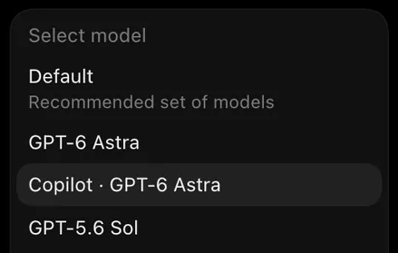

# Setup and reference

[Back to the project overview](../README.md)

Complete setup, security, model discovery and troubleshooting instructions.
Run shell examples from the repository root. Live model checks consume provider
usage; offline preparation does not authenticate or activate models for you.

**Start here:** [Build and prepare](#build-and-prepare-a-fresh-installation) →
[Sign in and start](#explicit-login-and-foreground-startup) →
[Verify and enable models](#discover-and-verify-models).

## Local security changes

- Bind only to numeric loopback addresses or `localhost`.
- Require a separate local bearer credential for `/v1/models` and `/v1/responses`,
  before buffering request bodies or contacting Copilot. This credential is never
  forwarded upstream. Missing or invalid credentials fail closed.
- Require `x-codex-router-key` on `/combined/v1` requests. Native Authorization
  is forwarded only to OpenAI; Copilot uses its separate service credential.
  The local access key is never forwarded to either provider.
- Never fall back between providers on errors. Native 401 responses remain
  available for Codex-managed refresh; combined Copilot auth failures return 502.
- Refuse redirects on the model/inference relay instead of forwarding clients to another destination.
- Reject unexpected Host/URI authorities, every Origin header, and browser Fetch
  Metadata headers. This is a native-client endpoint, not a browser API.
- Return only service name/status from unauthenticated `/health`.
- Default to a 16 MiB request-body limit. Zero cannot disable the limit.
- Bound upstream rate-limit retries by elapsed time (30 seconds by default) and
  at most eight retries. `Retry-After: 0` cannot create an unlimited loop.
  A successful SSE body uses the existing request timeout, not the retry deadline.
- Create credential files with private permissions before writing any secrets;
  flush/sync and replace them atomically. Reject unsafe parent paths, symlinks,
  and nonregular destinations. Newly created parent directories use `0700`.
- Validate discovered Copilot account endpoints before using them for authenticated inference.
- Update affected locked dependencies, including rustls `0.23.45`, anyhow
  `1.0.104`, and quinn-proto `0.11.15`.

Tokens remain plaintext on disk, protected by filesystem permissions, not the
macOS Keychain. These controls do not protect against malicious code already
running as your user or root. Keep raw diagnostics disabled. Account entitlement,
provider terms, and model policy are separate from local software security.

Loopback HTTP does not authenticate the listening process itself. Use this on a
trusted workstation, keep the managed service in control of its port, and do not
treat it as a hardened boundary against a hostile local multi-user environment.

## Build and prepare a fresh installation

Requirements: macOS for the App/LaunchAgent workflow, Rust/Cargo, Python 3.11 or
newer, and a Codex binary that supports `debug models --bundled` and
`model_catalog_json`. Use a Codex version compatible with the installed App.
Keep your ChatGPT-backed Codex login for native models in the default configuration
and use a separate GitHub Copilot login for Copilot models. Do not copy credentials
from another agent. The default native upstream is not the OpenAI API-key endpoint.

From a reviewed checkout of this fork:

```sh
cargo test --locked
python3 -m unittest discover -s tests -p 'test_*.py'
cargo clippy --locked --all-targets -- -D warnings
cargo build --release --locked --bins
install -d -m 700 "$HOME/.local/share/codex-code-router"
cargo install --path . --bins --locked --root "$HOME/.local/share/codex-code-router"
python3 scripts/prepare_setup.py --codex "$(command -v codex)"
```

The preparation command is offline. It creates private local state and a local
client key, installs the sanitized launcher, extracts bundled native metadata,
and writes a private Codex configuration fragment. It does **not** log in,
start the router or launchd, enable Copilot models, or edit your Codex settings.
It preserves an existing client key and active catalogue; unsafe or conflicting
files are refused rather than overwritten. Resolve a reported conflict explicitly
before retrying. `--home` is available for isolated setup verification.

| Prepared path | Purpose |
| --- | --- |
| `~/.local/bin/codex-copilot-router` | Sanitized foreground/login launcher |
| `~/.local/share/codex-code-router/client-token` | Local access key; `0600`, never publish |
| `~/.local/share/codex-code-router/native-models.json` | Bundled native metadata used to seed discovery |
| `~/.local/share/codex-code-router/desktop-models.json` | Active startup catalogue; native-only until explicit promotion |
| `~/.local/share/codex-code-router/codex-router.config.toml` | Private configuration fragment; contains the local access key |

Open the generated fragment locally and review it. Back up your existing
`$CODEX_HOME/config.toml` (normally `~/.codex/config.toml`) privately, then merge
the fragment's top-level keys and provider tables without duplicating existing
tables. For a fresh configuration, use the fragment as the starting file. Keep
the configuration and backups owner-only (`0600`), and keep unrelated model,
MCP, approval and sandbox settings. The setup helper deliberately does not perform
this merge or change the active model for you. Never paste the fragment into a
public issue or chat.

### Explicit login and foreground startup

```sh
~/.local/bin/codex-copilot-router login
# Inspect and personally approve the genuine GitHub device authorization.
~/.local/bin/codex-copilot-router serve
```

Keep the foreground process running while using the router; use a second terminal
for discovery. It stores its own account tokens at
`~/.local/share/codex-code-router/copilot-tokens.json`. The launcher clears inherited
endpoint/token overrides, binds loopback, and keeps raw diagnostics off. It no
longer pins one account's enterprise host: the Rust service uses validated endpoint
metadata from the service token, with the generic GitHub endpoint as the fallback
when metadata is absent. Explicit endpoint overrides on the raw binary remain
available for controlled deployments and offline tests; they are trusted operator
configuration, not permission to send credentials to an untrusted server.

Follow [Discover and verify models](#discover-and-verify-models) before activating
Copilot entries. The initial native catalogue is a bundled snapshot, not proof of
account entitlement. Fully quit and reopen Codex when active work is finished to
load reviewed configuration/catalogue changes. The router must be running for
both provider routes.

### Optional macOS login startup

After foreground startup has been verified, stop that foreground process before
transferring supervision to launchd. Do not run competing supervisors.

```sh
python3 scripts/install_launchagent.py --render
python3 scripts/install_launchagent.py
# Only when the previous process has stopped and port 60001 is free:
python3 scripts/install_launchagent.py --load
```

The user LaunchAgent is `local.codex-copilot-router`. It starts at GUI login and
restarts after an unsuccessful exit, with a ten-second throttle. The installer
refuses unsafe files, conflicting registrations and occupied ports; it does not
kill another process. Logs are private files under the runtime directory's `logs`.
Use launchd, not the inherited PID-file `ccrx start/restart` commands, to manage
this installation.

```sh
launchctl print "gui/$(id -u)/local.codex-copilot-router"
# Restart only when no work is active:
launchctl kickstart -k "gui/$(id -u)/local.codex-copilot-router"
# Stop the loaded service; the plist remains for a future GUI login:
launchctl bootout "gui/$(id -u)/local.codex-copilot-router"
```

### Upgrading this fork

There is no self-update command. The inherited updater was removed because it
could replace this fork with the original crates.io package. Review a new checkout,
run its checks, and rebuild/install from that checkout with the locked commands
above. Review launcher changes separately before explicitly replacing an existing
launcher. Preserve private runtime state and arrange any restart when idle; source
updates do not automatically update the running service or App.

## Desktop: native and Copilot models side by side

The Desktop picker chooses model IDs, not providers. The combined endpoint uses
unchanged native IDs for OpenAI and catalogue-derived aliases for verified Copilot models, for example:

| Picker entry | Routed model ID | Destination |
| --- | --- | --- |
| Existing native entries | Existing native ID | OpenAI |
| Copilot · GPT-6 Astra | `copilot/gpt-6-astra` | GitHub Copilot |
| Copilot · GPT-5.6 Sol | `copilot/gpt-5.6-sol` | GitHub Copilot |

Native and Copilot models appear together in the model picker:



Copilot Sol exposes reasoning-effort choices in the same interface:


These cropped screenshots show one installation; available models and reasoning
choices depend on account access and the active catalogue. They do not require
unrestricted tool permissions.

The shared user configuration selects `desktop-router`, whose base URL is
`http://127.0.0.1:60001/combined/v1`, with `requires_openai_auth = true` and
`supports_websockets = false`. Codex continues managing native authentication;
the router does not read or copy native credential files. A separate
`http_headers` entry supplies `x-codex-router-key` from the existing local key.
Because that header value is a secret, the configuration and backups must be
owner-only `0600`. Do not commit them. Rotate both the key file and this header
together, then restart the router and reload Codex.

`model_catalog_json` selects the private `desktop-models.json` snapshot: original
native descriptors plus verified namespaced Copilot descriptors. The router uses
the same file as its startup allowlist; adding a discovered model does not require
editing Rust model-name lists. Native model IDs remain unchanged. Review/regenerate
the snapshot when model metadata changes. Reload the router and Desktop app-server
to apply the startup catalogue;
do not interrupt active work without permission. No signed application files are
modified. The router must be running for combined-mode native and Copilot calls.

Native Responses, compact and lite paths can be forwarded to their corresponding
OpenAI endpoints. Explicit Copilot compact/lite requests fail with 501 rather than
being sent to OpenAI. Browser requests and encoded combined bodies are rejected.

**Compaction is not simply disabled.** In the tested Codex build, the generated
custom provider name `Native OpenAI + GitHub Copilot (local)` selects Codex-managed
summarization through ordinary `/responses` requests. Manual and forced automatic
compaction completed in an isolated app-server replay using the installed Sol
descriptor, synthetic ChatGPT auth and synthetic responses. The replay matched
`features.context_management.experimental_mode = true`; it did not measure live
Copilot summarization quality or sustained long-session reliability.

Keep the generated provider name: changing it to `OpenAI` changes Codex's provider
capability selection, including remote compaction and request compression. The
router does not implement a Copilot remote-compaction adapter, local response-ID
storage, stream-ID repair or image rewriting. An upstream protocol quirk may still
reach the client unchanged. This integration does not claim every provider-specific
feature is interchangeable.

### Subagents

Copilot descriptors use Codex's client-managed `v1` subagent protocol, with
plain-text task handoffs. Native descriptors retain their own version. This
avoids inheriting native encrypted v2 handoffs from the template; do not remove
encrypted task content to make a failed request pass.

An existing global `features.multi_agent_v2.enabled = true` overrides every
model's descriptor. For model-selected protocols, change only that setting to
`false` while keeping `features.multi_agent = true`:

```toml
[features.multi_agent_v2]
enabled = false
```

Edit an existing table rather than adding a duplicate, and preserve its other
settings. Regenerate/review the Copilot catalogues, reload Codex when idle, and
start a **fresh Copilot conversation**. Codex fixes the protocol for a conversation
tree and passes it to children; changing a child's model alone cannot change it.
Keep native-v2 and Copilot-v1 agent trees separate rather than mixing providers
within a v2 tree. Existing conversations and history are not rewritten.

To roll back an existing forced-v2 setup, restore its previous
`features.multi_agent_v2.enabled = true` value, reload Codex when idle, and
start a fresh conversation. Existing conversation trees retain the protocol
selected when they were created.

Verification used the installed app-server with synthetic parent/child flows,
plus one bounded live Sol worker request whose successful response was replayed
through Codex's child-to-parent return path. This is not a guarantee for every
model, tool registry, or future client version. Tool discovery, code mode,
approvals and sandbox settings remain available and unchanged.

### Context defaults and optional long context

As verified on 2026-09-20, native Codex App/CLI and this installation's combined
Copilot catalogue use these settings:

| Model | Default `context_window` | Override ceiling `max_context_window` |
| --- | --- | --- |
| GPT-5.6 Sol | 272,000 tokens | 872,000 tokens |
| GPT-6 Astra | 272,000 tokens | 872,000 tokens |

The ceiling does **not** enable long context automatically. Keep the default to
match native Codex; increase it only when retaining more conversation, code and
tool output before compaction is useful. Model metadata and account limits can
change, so recheck the active catalogue after updates.

For one CLI session with the combined provider configured above:

```sh
codex --model copilot/gpt-5.6-sol -c model_context_window=500000
```

Replace the alias with `copilot/gpt-6-astra` for Astra. This does not save a new
default or change an already running Desktop session. Dedicated Copilot-only
connections use unprefixed model IDs, as shown below.

For a persistent override shared by Codex App and CLI, add the setting at the
**top level** of `$CODEX_HOME/config.toml` (normally `~/.codex/config.toml`), before
any `[section]` headers:

```toml
model_context_window = 500000
# Optional: start history compaction earlier than the model-derived threshold.
model_auto_compact_token_limit = 450000
```

These are illustrative budgets, not required settings. The second setting
controls compaction timing, not model capacity. Fully quit and reopen the App
when active work is finished, then start a fresh conversation. No router restart
or catalogue edit is needed for this configuration-only override.

The global override applies to whichever model is selected, not just Sol/Astra;
profile or command-line settings can override it. Codex clamps the requested
window to the model's advertised ceiling, and an override cannot increase the
provider's actual capacity. To restore defaults, remove the context and optional
compaction overrides from the applicable configuration/profile, then reload Codex.

**Cost:** larger context can increase usage and enter Copilot's higher-priced
long-context tier above 272k input tokens for Sol/Astra. It does not fill the
window automatically. Reasoning effort is independent of context capacity.
Check current account pricing before opting in.

Sources: [Codex configuration reference](https://learn.chatgpt.com/docs/config-file/config-reference),
[upstream model catalogue](https://github.com/openai/codex/blob/main/codex-rs/models-manager/models.json),
[Sol override-ceiling change](https://github.com/openai/codex/pull/39102), and
[Copilot model pricing](https://docs.github.com/en/copilot/reference/copilot-billing/models-and-pricing).

### Discover and verify models

With the foreground router running, generate private staging files. For first
setup, use the native seed produced by `prepare_setup.py`; for later refreshes,
use your reviewed active catalogue as `--native-catalog` when preserving its
native entries and descriptor provenance is intended.

```sh
python3 scripts/refresh_catalog.py \
  --native-catalog "$HOME/.local/share/codex-code-router/native-models.json" \
  --output "$HOME/.local/share/codex-code-router/candidate-desktop-models.json" \
  --copilot-output "$HOME/.local/share/codex-code-router/candidate-copilot-models.json" \
  --codex "$(command -v codex)"
```

Discovery reads the account's current catalogue but never enables a policy or
accepts terms. It excludes hidden/disabled entries, non-Responses protocols, and
models without streaming/tool calls or usable limits. Native descriptors remain
unchanged. Copilot descriptors use matching native/bundled metadata or an existing
verified alias before a conservative generic fallback; provider-only retirement,
speed-tier, vision and context claims are corrected against live capabilities.

`supports_search_tool` means Codex's on-demand MCP/tool discovery, **not web
search**. Preserve it from supported descriptors. Clearing it can inline the
entire connected-tool registry, causing a single oversized description and a
prompt that exceeds smaller models before the first user message is processed.
Copilot entries with this capability use `code_mode_only`, keeping discovery in
Codex's client-owned `tools` / `ALL_TOOLS` runtime instead of emitting a hosted
`tool_search` type that older backends reject. Tool definitions and permissions
remain available; they are not truncated or silently disabled.

The generated configuration fragment also defines `copilot-proxy`, so a selected
candidate can be tried without activating the combined catalogue. For example,
if your discovery report lists Sol as enabled:

```sh
codex --model gpt-5.6-sol --sandbox read-only \
  -c model_provider=copilot-proxy \
  -c "model_catalog_json=\"$HOME/.local/share/codex-code-router/candidate-copilot-models.json\""
```

**A live model trial consumes provider usage.** Run it deliberately with synthetic
input, not private code. Availability in discovery is not a guarantee of inference
access or tool reliability. Keep only reviewed models in the candidate pair before
promotion; do not activate unverified entries merely because they were discovered.

Validate with large registries and the real enabled tool configuration, not just
an empty synthetic workspace. Context limits remain real limits: a genuinely
oversized conversation still needs appropriate compaction before a downshift.
Compatibility checks do not guarantee every model is equally reliable at tool
orchestration.

Verify candidates in supervised, isolated Codex sessions with synthetic files and
no copied native credentials. A useful transport probe starts with a subtraction
bug in a two-argument `add` function and requests the exact one-operator patch,
using native `apply_patch` and shell tools. Inspect the resulting files and the
unchanged fixture before running independent checks; reject unexpected files,
symlinks, background processes, or unrelated edits. Neither a model's success
claim nor a zero process exit proves that assertions ran.

For namespaced-alias checks, a separate validation router can load the staged
combined catalogue while the normal router keeps its existing catalogue. These
are manually reviewed compatibility probes, not an automated certification of
arbitrary model-generated code. Failed or unreviewed candidates must not be promoted.

Promote only a complete, successfully generated and verified staging pair. Keep
private backups, stop the router and close Codex when idle, then use the existing
private-write/rollback helper from the checkout:

```sh
python3 - <<'PY'
from pathlib import Path
from scripts.refresh_catalog import MAX_BYTES, parse_json, read_regular_file, write_outputs

root = Path.home() / ".local/share/codex-code-router"
pairs = [
    (root / "desktop-models.json", root / "candidate-desktop-models.json"),
    (root / "copilot-models.json", root / "candidate-copilot-models.json"),
]
write_outputs([(active, parse_json(read_regular_file(candidate, MAX_BYTES)))
               for active, candidate in pairs])
PY
```

Outputs are private and each replacement is atomic; ordinary write failures roll
back earlier replacements. This is not a cross-file transaction across power loss.
An interrupted generation is not a completed pair: regenerate it. Restart the
router, then reopen Codex to load the reviewed entries. Never commit runtime
catalogues, credentials, native prompt caches or verification output.

## Copilot-only CLI

The generated fragment includes this provider with your actual absolute key path.
It reads the **local** credential, not the GitHub or Copilot account token:

```toml
[model_providers.copilot-proxy]
name = "GitHub Copilot (local hardened)"
base_url = "http://127.0.0.1:60001/v1"
wire_api = "responses"
supports_websockets = false
request_max_retries = 1
stream_max_retries = 2
stream_idle_timeout_ms = 300000

[model_providers.copilot-proxy.auth]
command = "/bin/cat"
args = ["/absolute/path/to/.local/share/codex-code-router/client-token"]
timeout_ms = 5000
refresh_interval_ms = 300000
```

Use an actual absolute path in TOML. Do not combine command-backed `auth` with
`env_key`, `experimental_bearer_token`, or `requires_openai_auth`.

For a one-session Copilot-only connection after promotion:

```sh
codex --model gpt-5.6-sol \
  -c model_provider=copilot-proxy \
  -c "model_catalog_json=\"$HOME/.local/share/codex-code-router/copilot-models.json\""
```

Use an enabled model ID from your discovery report. The flags do not rewrite your
default provider/model. Named profiles are optional and are not created by the
preparation helper; use your installed Codex version's profile format if desired.
Reasoning, vision and context claims are bounded by discovered capabilities.
OpenAI-specific priority tiers are not offered.

Catalogue visibility does not prove inference permission. Do not enable policies,
impersonate another client or bypass authorization denials to gain access. Live
account inference must be verified separately from synthetic local protocol tests.

## Configuration reference

| Variable | Default | Meaning |
| --- | --- | --- |
| `HOST` | `127.0.0.1` | Loopback bind address only. |
| `PORT` | `60001` | Local port. |
| `CODEX_CODE_ROUTER_CLIENT_TOKEN_FILE` | `~/.local/share/codex-code-router/client-token` | Required local client credential file. |
| `CODEX_CODE_ROUTER_MODEL_CATALOG` | `~/.local/share/codex-code-router/desktop-models.json` | Startup catalogue/allowlist for combined Copilot aliases. |
| `COPILOT_RESPONSES_URL` | account metadata, then `https://api.githubcopilot.com/responses` | Explicit raw-binary override takes precedence over discovery. |
| `COPILOT_MODELS_URL` | account metadata, then `https://api.githubcopilot.com/models` | Explicit raw-binary override takes precedence over discovery. |
| `NATIVE_OPENAI_BASE_URL` | `https://chatgpt.com/backend-api/codex` | Native ChatGPT-backed Codex endpoint base; not the API-key billing endpoint. |
| `COPILOT_BEARER_TOKEN` | unset | Optional service-owned upstream token; the wrapper does not inherit it. |
| `COPILOT_TOKEN_FILE` | `~/.copilot-tokens.json` | Wrapper overrides this to the private runtime directory. |
| `COPILOT_TOKEN_REFRESH` | `true` | Refresh expiring account tokens and retry one upstream 401. |
| `COPILOT_TOKEN_EXPIRY_BUFFER_SECONDS` | `300` | Refresh buffer. |
| `REQUEST_BODY_LIMIT_BYTES` | `16777216` | Finite body limit; values below 1024 fall back to default. |
| `REQUEST_TIMEOUT_MS` | `300000` | Upstream request/stream timeout. |
| `RATE_LIMIT_MAX_TOTAL_WAIT_MS` | `30000` | Elapsed retry budget, including response-header waits and reactive auth refresh. Zero/invalid values use the default. |
| `RATE_LIMIT_MAX_SLEEP_MS` | `60000` | Per-retry sleep ceiling, further bounded by remaining elapsed budget. |
| `RATE_LIMIT_INITIAL_BACKOFF_MS` | `1000` | Fallback retry backoff. |
| `RATE_LIMIT_BACKOFF_MULTIPLIER` | `2` | Backoff multiplier. |
| `CODEX_CODE_ROUTER_RAW_LOG_LEVEL` | `off` | Keep disabled for real credentials and private prompts. |

Initial upstream token resolution retains its request timeout; the retry deadline
begins after that resolution. New requests may still fail from provider rate
limits or account policy. Local retry limits do not override those restrictions.

## Verification and troubleshooting

```sh
curl --fail http://127.0.0.1:60001/health
```

An unauthenticated `/v1/models` request should return 401. Browser-origin requests
should return 403 even with valid local credentials. A configured body-limit
violation should return 413. Never paste tokens into diagnostics or support chats.

Source regression tests cover credential replacement/symlinks, caller guards,
byte-preserving forwarding, finite zero-delay retries, streaming duration,
refresh behavior, and existing diagnostic behavior. A synthetic local upstream
can verify the Codex/router protocol without sending private code or using quota;
it cannot establish actual Copilot model access.

## Publication and contribution boundaries

The source is MIT-licensed; retain the upstream license and attribution in copies
and derivatives. `publish = false` prevents accidental crates.io publication; it
does not make a GitHub repository public. No installer changes repository visibility.

This public repository starts from a reviewed source snapshot and does not import
private development history. Before publishing another private checkout, inspect
**all history and refs**, not only the latest tree: deleting data in a later commit
does not remove it from older commits. Complete a secret/privacy review before
publication, and never publish generated runtime files. If a real credential was
ever committed, revoke/rotate it; history cleanup alone is not sufficient.

Report client version, non-secret model ID, operation, error status and a minimal
synthetic reproduction. Do not attach account tokens, configuration fragments,
raw conversation logs or full native model catalogues. Changes should preserve
the Responses-only, credential-separated design rather than expand this fork
into a general compatibility gateway.
